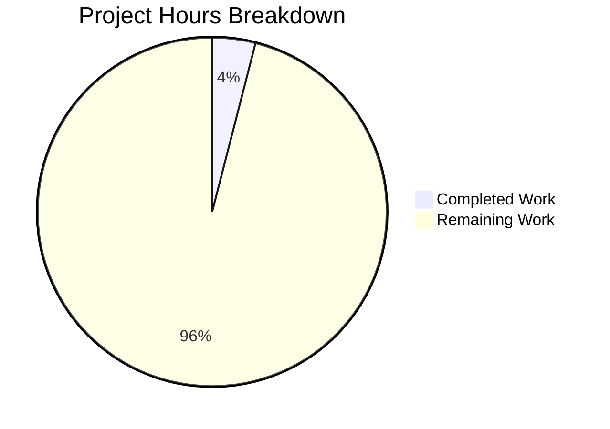

# Project Guide: NOV24_2 - Empty Repository Placeholder

## Executive Summary

**Project Completion: 4% (2 hours completed out of 50 total estimated hours)**

This repository is currently an **empty placeholder** awaiting project requirements and user clarification. No functional code has been implemented because the project scope, technology stack, and source code requirements have not been defined.

### Key Findings
- **Repository State**: Empty placeholder with no source code
- **Validation Status**: All checks N/A (Not Applicable)
- **Blocker**: Cannot proceed without user clarification on Jam.dev bug report content, technology stack, and refactoring objectives
- **Hours Completed**: 2 hours (repository initialization and framework setup)
- **Hours Remaining**: 48 hours (all implementation work)

---

## Validation Results Summary

### What the Final Validator Accomplished

| Validation Area | Status | Details |
|----------------|--------|---------|
| Repository Analysis | ✓ Complete | Confirmed empty placeholder state |
| Dependencies | N/A | No dependency manifest files present |
| Compilation | N/A | No source code to compile |
| Tests | N/A | No test framework or test files exist |
| Runtime | N/A | No application to run |
| Working Tree | ✓ Clean | No uncommitted changes |

### Repository Contents

| File | Description |
|------|-------------|
| `README.md` | Placeholder text ("# NOV24_2" repeated 5 times) |
| `test this` | Gibberish text ("efvgrtgrtgrtrgtgt") |
| `blitzy/screenshots/` | Empty directory (standard scaffold) |

### Git Commit History

| Commit | Description | Changes |
|--------|-------------|---------|
| 776281d | Create test this | +1 file, +1 line |
| 84a84ff | Update README.md | +1 line, -1 line |
| c3c07bb | Initial commit | +1 file, +1 line |

**Total: 3 commits, 3 lines of placeholder content**

---

## Project Hours Breakdown

### Calculation Methodology

Using hours-based assessment per PA1/PA2 framework:

```
Completed Hours (2h):
├── Repository initialization: 1.0h
└── Agent Action Plan analysis: 1.0h

Remaining Hours (48h):
├── Requirements clarification: 4.0h
├── Technology stack setup: 6.0h
├── Source code analysis/migration: 10.0h
├── Implementation: 14.0h
├── Testing setup and execution: 10.0h
└── Documentation: 4.0h

Total Project Hours: 50h
Completion: 2h / 50h = 4%
```

### Visual Representation



---

## Detailed Task Table

| # | Task | Description | Hours | Priority | Severity |
|---|------|-------------|-------|----------|----------|
| 1 | **Provide Jam.dev Bug Report Details** | User must provide textual description of the bug report content since the link cannot be accessed by automated systems | 2.0 | HIGH | BLOCKER |
| 2 | **Specify Technology Stack** | Define programming language, framework(s), and required tools for the project | 1.0 | HIGH | BLOCKER |
| 3 | **Identify Source Code Location** | Clarify whether code exists elsewhere and needs migration, or if this is a new implementation | 1.0 | HIGH | BLOCKER |
| 4 | **Define Refactoring Objectives** | Establish clear success criteria and scope boundaries | 2.0 | HIGH | HIGH |
| 5 | **Set Up Development Environment** | Install required tools, create virtual environment, configure IDE | 4.0 | HIGH | HIGH |
| 6 | **Create Dependency Manifest** | Generate package.json/requirements.txt/etc. based on technology stack | 2.0 | HIGH | HIGH |
| 7 | **Implement Core Application Structure** | Set up directory structure, entry points, and base configuration | 6.0 | HIGH | HIGH |
| 8 | **Implement Bug Fix or Main Feature** | Develop the primary functionality requested in the Jam.dev report | 14.0 | HIGH | HIGH |
| 9 | **Create Test Framework Setup** | Configure testing framework (pytest, jest, etc.) appropriate for stack | 2.0 | MEDIUM | MEDIUM |
| 10 | **Write Unit Tests** | Implement comprehensive unit test coverage for implemented features | 6.0 | MEDIUM | MEDIUM |
| 11 | **Write Integration Tests** | Add integration tests for component interactions | 2.0 | MEDIUM | MEDIUM |
| 12 | **Update Documentation** | Create comprehensive README, API docs, and developer guide | 4.0 | MEDIUM | LOW |
| 13 | **Configure CI/CD Pipeline** | Set up GitHub Actions or equivalent for automated testing | 2.0 | LOW | LOW |

**Total Remaining Hours: 48 hours**

---

## Risk Assessment

### Critical Risks (BLOCKER)

| Risk | Description | Impact | Mitigation |
|------|-------------|--------|------------|
| **Undefined Scope** | Project requirements are completely unknown due to inaccessible Jam.dev bug report | Development cannot begin | User must provide bug report details in text format |
| **No Technology Stack** | Programming language and framework not specified | Cannot set up environment or write code | User must specify technology requirements |
| **Unknown Source Code** | Whether existing code needs refactoring or new code creation is unclear | Cannot plan implementation approach | User must clarify source code situation |

### High Risks

| Risk | Description | Impact | Mitigation |
|------|-------------|--------|------------|
| **Incomplete Requirements** | Even with clarification, requirements may be ambiguous | Rework and delays | Request comprehensive requirements document |
| **Scope Creep** | Without defined boundaries, scope may expand | Budget and timeline overruns | Establish clear scope boundaries upfront |

### Technical Risks (Cannot Assess)

The following risks cannot be evaluated until source code and technology stack are defined:
- Security vulnerabilities
- Performance issues
- Scalability limitations
- Integration complexity
- Technical debt
- Dependency conflicts

---

## Development Guide

### Current State Prerequisites

Since no application exists, this guide covers only the current repository state:

#### 1. Clone Repository
```bash
git clone <repository-url>
cd NOV24_2
git checkout blitzy-901734f2-3cc6-40fe-97db-60102e7867e5
```

#### 2. Verify Repository Contents
```bash
# List all files
ls -la

# Expected output:
# README.md
# test this
# blitzy/
```

#### 3. View Current Files
```bash
# View README
cat README.md
# Output: # NOV24_2# NOV24_2# NOV24_2# NOV24_2# NOV24_2

# View test file
cat "test this"
# Output: efvgrtgrtgrtrgtgt
```

### Future Development Setup (Template)

Once technology stack is defined, the following setup pattern should be followed:

#### For Python Projects
```bash
# Create virtual environment
python -m venv venv
source venv/bin/activate  # Linux/Mac
# or: venv\Scripts\activate  # Windows

# Install dependencies (once requirements.txt exists)
pip install -r requirements.txt

# Run tests (once pytest is configured)
pytest -v

# Run application (once app exists)
python -m <app_name>
```

#### For Node.js Projects
```bash
# Install dependencies (once package.json exists)
npm install

# Run tests (once configured)
npm test

# Start application (once defined)
npm start
```

#### For Java Projects
```bash
# Build project (once pom.xml/build.gradle exists)
mvn clean install
# or: gradle build

# Run tests
mvn test
# or: gradle test

# Run application
java -jar target/<app>.jar
```

### Verification Steps

Currently, there is nothing to verify as no application exists. Once implemented:

1. **Dependency Check**: Verify all dependencies install without errors
2. **Build Check**: Confirm code compiles/transpiles successfully
3. **Test Check**: All tests pass with adequate coverage
4. **Runtime Check**: Application starts and responds to requests
5. **Feature Check**: Bug fix or feature works as specified

---

## Blockers Requiring Human Intervention

### BLOCKER 1: Jam.dev Bug Report Content
**Severity**: CRITICAL

The provided Jam.dev link (https://jam.dev/c/64dd6a4e-af7d-4e5a-b53a-7115d7a3ae11) cannot be accessed by automated systems.

**Required Action**: User must provide:
- Steps to reproduce the issue
- Expected vs actual behavior
- Error messages or stack traces
- Screenshots or recording descriptions
- Environment details (browser, OS, etc.)

### BLOCKER 2: Technology Stack Definition
**Severity**: CRITICAL

No technology stack has been specified for this project.

**Required Action**: User must specify:
- Primary programming language (Python, JavaScript, Java, Go, etc.)
- Framework(s) to use (FastAPI, Express, Spring Boot, etc.)
- Database system if applicable
- Any specific library requirements
- Deployment platform preferences

### BLOCKER 3: Source Code Location
**Severity**: CRITICAL

It is unclear whether:
- Existing code needs to be migrated to this repository
- Existing code needs to be refactored in place
- New code should be written from scratch

**Required Action**: User must clarify:
- Is there existing source code? If so, where?
- Should code be migrated, refactored, or newly created?
- What is the target architecture?

---

## Recommendations

### Immediate Actions (Before Development Can Begin)

1. **Provide Bug Report Details**: Copy the text content from the Jam.dev report and share directly
2. **Specify Technology**: State the programming language and any framework preferences
3. **Clarify Code Source**: Indicate whether existing code exists and its location
4. **Define Success Criteria**: What constitutes a successful completion of this work?

### Once Requirements Are Provided

1. **Phase 1: Setup (6-8 hours)**
   - Configure development environment
   - Set up dependency management
   - Create project structure

2. **Phase 2: Implementation (14-20 hours)**
   - Implement bug fix or main feature
   - Write supporting code
   - Handle edge cases

3. **Phase 3: Testing (8-12 hours)**
   - Set up test framework
   - Write unit and integration tests
   - Achieve target coverage

4. **Phase 4: Documentation (4 hours)**
   - Update README with setup instructions
   - Document API/functionality
   - Create developer guide

---

## Conclusion

This repository is currently a placeholder awaiting project requirements. The Agent Action Plan has been thoroughly prepared with frameworks for handling various scenarios (bug fix refactoring, code migration, new implementation), but actual development cannot proceed until the user provides:

1. Jam.dev bug report content (in text form)
2. Technology stack specification
3. Source code location and refactoring objectives

**Estimated Total Project Hours**: 50 hours
**Hours Completed**: 2 hours (4%)
**Hours Remaining**: 48 hours (96%)

Once requirements are provided, this project guide will be updated with specific implementation details, file structures, and development commands appropriate for the chosen technology stack.